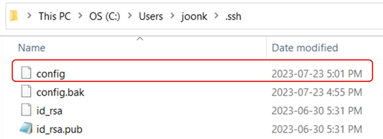

# GitHub: Configure SSH-key for each repo using ***config*** file

### 1. Create a "config" file (without any extension) within the ".ssh" directory

> Note: The default ".ssh" directory is usually located at user's folder, such as "C:\\Users\\admin\\.ssh"



### 2. Modify the "config" file as follow (you can open with any text editor):

```         
Host github.com-github_username
Hostname github.com
User git 
IdentityFile ~/.ssh/your_private_id_rsa_filename
```

### 3. Clone the repo using SSH approach.

The link needs to be modified before `git clone` by adding the hostname which was set in the ***config*** file.

For example:

Before adding hostname,

```         
git clone git@github.com:github_username/repo.git
```

After adding hostname,

```         
git clone git@github.com-github_username:github_username/repo.git
```